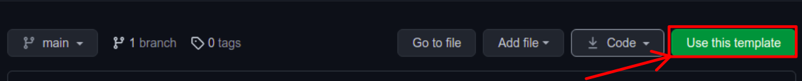
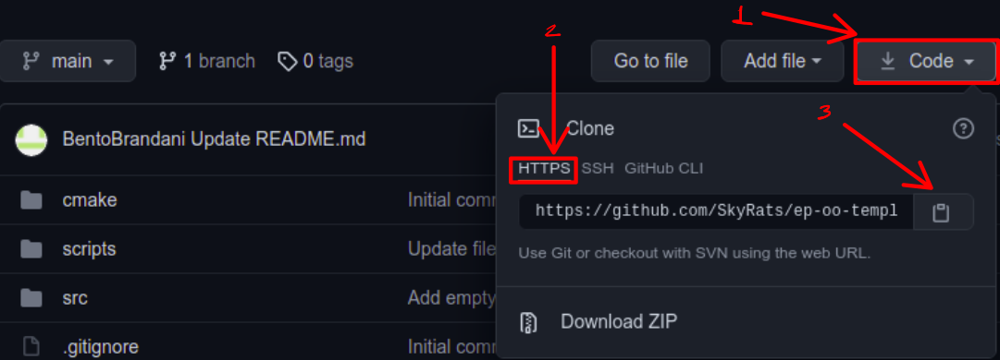

# Exercício Programa - Programação Orientada a Objeto

Esse template foi desenvolvido com intuito de facilitar a compilação e a correção do EP. Lembre-se que seus veteranos continuam totalmente disponíveis para ajudá-los com o entendimento ou execução do EP.

## Instalação

1. Crie uma cópia deste *template* na sua conta pessoal do GitHub clicando no botão *Use this template*;

    

2. Clone o repositório criado, lembrando que a URL do seu repositório pessoal pode ser acessada por meio do botão *Code* na aba HTTPS;
    
    ```bash
    # tomando como exemplo o reporitorio de URL
    # https://github.com/User/TemplateOO.git
    $ git clone https://github.com/User/TemplateOO.git
    ```

3. Instale os requisitos de execução.

    Os requisitos diferem entre o desenvolvimento em C++ e em Python.

    1. Python

        Caso não tenha ainda, é necessário instalar o próprio Python; além disso, é necessário instalar o gerenciador de pacotes de Python `pip` e o pacote `pytest`. Isso pode ser feito com os comandos:
        ```bash
        $ sudo apt install python python-pip -y
        $ pip install pytest
        ```

    2. C++

        Um script de instalação da ferramente de build CMake foi fornecido com esse repositório; devemos torná-lo executável e executá-lo.
        ```bash
        $ chmod +x install_cmake.sh
        $ ./install_cmake.sh
        ```

## Desenvolvimento

### Python

Os arquivos `bateria.py`, `drone.py`, `s1000.py` e `main.py` com os as assinaturas das funções requisitadas no enunciado foram fornecidos na pasta `scripts/`. É importante que você **não modifique** as assinaturas fornecidas, mas você pode adicionar tantos arquivos, classes, métodos ou atributos quanto desejar.

### C++

Os *headers* com assinaturas das classes e métodos públicos e arquivos de código fonte vazios foram fornecidos na pasta `src/drone`, além de uma `main.cpp` fornecida em `src/`. É importante que você **não modifique** as assinaturas fornecidas **nem mova qualquer um dos arquivos fornecidos**, porque isso vai afetar o processo de *build* com o CMake. Contudo, você pode adicionar tantas classes, métodos ou atributos quanto desejar.

Para facilitar o processo de compilação com vários arquivos colocados em várias pastas, usamos uma ferramenta de *build* chamada CMake (por isso todos esses `CMakeLists.txt` por todas as pastas). Para simplificar o seu uso, fornecemos o script *bash* `utils.sh`. Um exemplo de uso do script é:
```bash
$ chmod +x utils.sh
$ ./utils.sh -c ./ build # cria pasta build com arquivos do CMake analisados
$ ./utils.sh -b build # compila o seu codigo
$ ./utils.sh -r # roda o executavel gerado por main.cpp
```

#### Como utilizar o script?

Primeiramente, em caso de dúvida, utilize a flag `--help` ou `-h` para ter acesso a descrição das funcionalidades desse script com seus respectivos argumentos.

```
$ ./utils.sh –-help
Utilizacao
./utils.sh [-h -r -t] [-vt] [-c | -C source_dir build_dir] [-b build_dir]
-h | --help
  Imprime esta mensagem
-r | --run
  Executa o programa compilado em C++
-t | --test
  Executa os testes fornecidos no diretorio test/
-vt | --verbose-test
  Executa os testes e mostra saida dos casos de falha
-c  source_dir build_dir
  Reanaliza os arquivos CMakeLists.txt
-C source_dir build_dir
  Reanaliza os arquivos CMakeLists.txt e habilita testes
-b | --build build_dir
  Compila os arquivos C++ para serem executados
--build-and-run build_dir
  Compila os arquivos C++ e executa o programa gerado
```

## Testes

### C++

É preciso renalisar os arquivos do CMake habilitando os testes. Isso é feito com a flag `-C` do script fornecido. Com isso, basta compilar seu código e os testes realizando o *build* como antes.
```bash
./utils.sh -C ./ build
./utils.sh -b build
```

As flags `-t`  e `-vt`  podem ser usadas para executar os testes depois de compilá-los.
```bash
./utils.sh -t
./utils.sh -vt
```

Vale notar que o tempo de build aumenta um pouco com os testes. Caso isso incomode você, é recomendado somente habilitar os testes quando achar que terminou a implementação de uma função da interface.

### Python

Os testes serão disponibilizados em breve.
